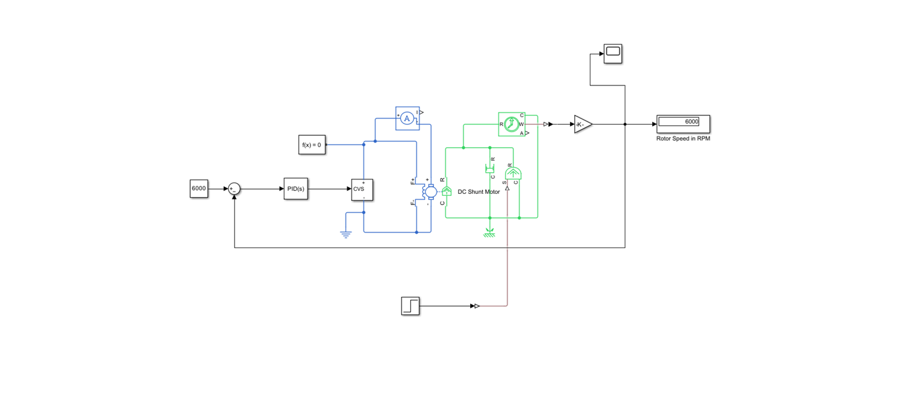

# Electrical Projects

## DC Shunt Motor Fault Analysis

### Project Overview
This project simulates transient fault conditions in a DC Shunt Motor using MATLAB/Simulink. It analyzes system behavior during electrical faults to observe stability and design protection circuits.

### Simulink Model Circuit
Here is the complete block diagram of the simulation:

